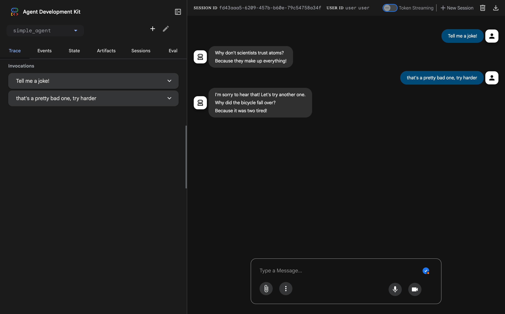
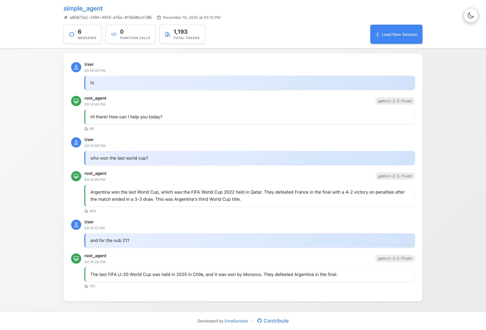

## Kaggle 5 days of AI course

Repository for [5-day agents course](https://www.kaggle.com/learn-guide/5-day-agents).

Using on [Google ADK](https://google.github.io/adk-docs/)

## Setup

This project is using `uv` as package manager, so please install it.

```bash
> uv sync
```

## Commands

### Start web UI

```bash
# Starts a FastAPI server with Web UI for agents.
> uv run adk web

INFO:     Started server process [29954]
INFO:     Waiting for application startup.

+-----------------------------------------------------------------------------+
| ADK Web Server started                                                      |
|                                                                             |
| For local testing, access at http://127.0.0.1:8000.                         |
+-----------------------------------------------------------------------------+
```



### Running agent via CLI

```bash
# Runs an interactive CLI for a certain agent.
> uv run adk run agent_name
```

### Creating a new agent

```bash
# Bootstrap a new agent
> uv run adk create agent_name
```

## Sessions

For each agent you can find a `sessions` folder where you can find example of the conversation with the agent itself.

Example of a conversation with the simplest agent: [simple_agent session example](./simple_agent/sessions/session-a03873a1-1984-4919-af6a-8f6b60cef206.json)

It might be a bit difficult to read the whole JSON content, so I made an ADK session online viewer for this need. Just visit: https://emasuriano.github.io/adk-session-reader/ and upload the session file to preview the session in a readable way.


